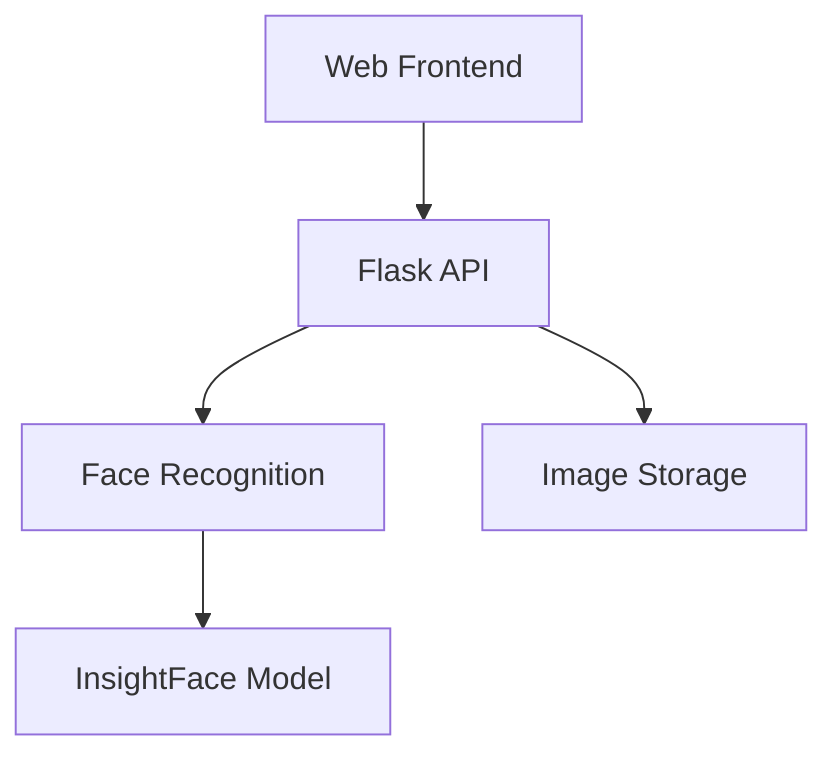

# 📸 Adding Screenshots and Demos to CvArdi BI

This guide explains how to add professional screenshots and demo GIFs to enhance the project documentation.

## Why Screenshots Matter

Screenshots and GIFs provide:
- **Instant understanding** of what the app does
- **Professional appearance** for recruiters and stakeholders
- **Visual proof** that the project works
- **Better engagement** with potential users/contributors

## Tools You'll Need

### For Screenshots
- **Mac**: Command + Shift + 4 (built-in)
- **Windows**: Snipping Tool or Snip & Sketch
- **Cross-platform**: [ShareX](https://getsharex.com/), [Flameshot](https://flameshot.org/)

### For GIFs
- **Mac**: [Kap](https://getkap.co/) (free, lightweight)
- **Windows/Mac**: [ScreenToGif](https://www.screentogif.com/) (free)
- **Cross-platform**: [LICEcap](https://www.cockos.com/licecap/) (free)
- **Browser-based**: [Recordit](https://recordit.co/)

### For Diagrams
- **Draw.io**: https://app.diagrams.net/ (free, no account needed)
- **Excalidraw**: https://excalidraw.com/ (free, simple sketches)
- **Mermaid**: https://mermaid.live/ (code-based diagrams)
- **Figma**: https://figma.com/ (professional design tool)

## What Screenshots to Capture

### 1. Main Interface (Priority: HIGH)
- **File**: `docs/images/screenshots/main-interface.png`
- **Content**: The landing page or main dashboard
- **Best practices**:
  - Show actual data (not empty states)
  - Use light theme for better visibility
  - Capture at 1920x1080 or 1280x720
  - Include browser chrome if it adds context

### 2. Upload Flow (Priority: HIGH)
- **File**: `docs/images/screenshots/upload-selfie.png`
- **Content**: The selfie upload interface
- **Best practices**:
  - Show the upload button/drag-drop area
  - Include a sample image being uploaded
  - Show any validation messages

### 3. Results Gallery (Priority: HIGH)
- **File**: `docs/images/screenshots/results-gallery.png`
- **Content**: Images that matched the user's face
- **Best practices**:
  - Show multiple results if available
  - Highlight the face detection overlay
  - Include relevant metadata (confidence score, etc.)

### 4. Mobile App (Priority: MEDIUM)
- **Files**: 
  - `docs/images/screenshots/mobile-camera.png`
  - `docs/images/screenshots/mobile-gallery.png`
- **Content**: Native mobile experience
- **Best practices**:
  - Use phone mockup for better presentation
  - Show both iOS and Android if possible
  - Capture actual device screenshots, not emulator

## What GIFs to Create

### 1. Full Workflow Demo (Priority: HIGH)
- **File**: `docs/images/demos/full-workflow.gif`
- **Duration**: 10-15 seconds
- **Content**: End-to-end user flow:
  1. Landing on the app
  2. Uploading a selfie
  3. Processing animation
  4. Results appearing
- **Settings**:
  - Frame rate: 10-15 FPS (smooth but small file)
  - Resolution: 1280x720 or smaller
  - Target file size: < 5MB

### 2. Face Recognition in Action (Priority: MEDIUM)
- **File**: `docs/images/demos/face-recognition.gif`
- **Duration**: 8-10 seconds
- **Content**: Show face being detected and matched
- **Settings**: Same as above

## How to Add Screenshots

### Step 1: Capture Screenshots
1. Run the application locally
2. Navigate to the feature you want to capture
3. Use your screenshot tool to capture
4. Save with descriptive filename

### Step 2: Optimize Images
```bash
# Install ImageMagick (if not already installed)
# Mac: brew install imagemagick
# Ubuntu: sudo apt-get install imagemagick

# Resize to max width of 1280px
convert input.png -resize 1280x input-optimized.png

# Compress PNG
pngquant input.png --output input-compressed.png
```

Or use online tools:
- [TinyPNG](https://tinypng.com/) - Compress PNG/JPG
- [Squoosh](https://squoosh.app/) - Google's image optimizer

### Step 3: Add to Documentation Folder
```bash
# Copy to appropriate folder
cp screenshot.png docs/images/screenshots/main-interface.png
```

### Step 4: Update README.md
```markdown
## Screenshots

### Main Interface


### Upload Flow

```

## How to Create GIFs

### Using Kap (Mac)

1. Download and install [Kap](https://getkap.co/)
2. Open Kap and adjust recording area
3. Click record and perform actions
4. Stop recording
5. Export as GIF with these settings:
   - Frame rate: 10 FPS
   - Quality: Medium
   - Size: 50-70% of original

### Using ScreenToGif (Windows)

1. Download [ScreenToGif](https://www.screentogif.com/)
2. Click "Recorder" and adjust window
3. Press F7 to start recording
4. Perform actions (aim for 10-15 seconds)
5. Press F8 to stop
6. Edit: Remove unnecessary frames
7. Save with these settings:
   - Encoder: System.Drawing
   - Quality: 90
   - Maximum colors: 256

### Optimizing GIFs

```bash
# Install gifsicle
# Mac: brew install gifsicle
# Ubuntu: sudo apt-get install gifsicle

# Optimize GIF
gifsicle -O3 input.gif -o output.gif

# Further compression if needed
gifsicle -O3 --colors 128 input.gif -o output.gif
```

Or use [ezgif.com](https://ezgif.com/optimize) for online optimization.

## Creating Architecture Diagrams

### Using Draw.io

1. Go to https://app.diagrams.net/
2. Create new diagram
3. Use shapes from left sidebar:
   - Rectangles for components
   - Arrows for data flow
   - Cylinders for databases
   - Cloud shapes for external services
4. Export as PNG (File → Export as → PNG)
   - Use transparent background
   - Scale: 100%
   - Border width: 10px

### Using Mermaid (Code-based)

Create diagram in markdown:

```markdown

```

Render at https://mermaid.live/ and export as PNG/SVG.

### Using Excalidraw

1. Go to https://excalidraw.com/
2. Draw using hand-drawn style (looks professional yet approachable)
3. Export as PNG with:
   - Scale: 2x (for high DPI displays)
   - Background: White
   - Embed scene: Yes (allows editing later)

## Best Practices

### General Guidelines
- ✅ Use consistent styling across all images
- ✅ Include actual data (not Lorem Ipsum)
- ✅ Show successful states (not error states) unless demonstrating error handling
- ✅ Use standard resolutions (1280x720, 1920x1080)
- ✅ Compress images to reduce file size
- ✅ Use descriptive filenames
- ❌ Don't include sensitive data (API keys, personal info)
- ❌ Don't use blurry or low-quality images
- ❌ Don't create unnecessarily large files

### File Size Targets
- Screenshots: < 500KB each
- GIFs: < 5MB each
- Total docs/images folder: < 20MB

### Naming Convention
```
docs/images/
├── screenshots/
│   ├── main-interface.png
│   ├── upload-selfie.png
│   ├── results-gallery.png
│   ├── mobile-camera.png
│   └── mobile-gallery.png
│
├── demos/
│   ├── full-workflow.gif
│   └── face-recognition.gif
│
└── architecture/
    ├── system-architecture.png
    ├── data-flow.png
    └── component-diagram.png
```

## Example Workflow

1. **Capture screenshots** of all major features
2. **Create a GIF** of the main workflow
3. **Optimize** all images/GIFs
4. **Move files** to appropriate folders
5. **Update README.md** with image references
6. **Commit and push** to repository
7. **Verify** images display correctly on GitHub

## Testing Your Images

Before committing, verify:
```bash
# Check file sizes
ls -lh docs/images/**/*

# Preview in browser
open docs/images/screenshots/main-interface.png

# Test in local README
# Open README.md in a Markdown previewer
```

## Need Help?

If you encounter issues:
1. Check that file paths are correct in README.md
2. Verify images are in PNG/JPG/GIF format
3. Ensure file sizes are reasonable (< 5MB for GIFs)
4. Test that images display on GitHub preview

---

**Ready to add visuals?** Start with the main interface screenshot and full workflow GIF—these provide the most value!
